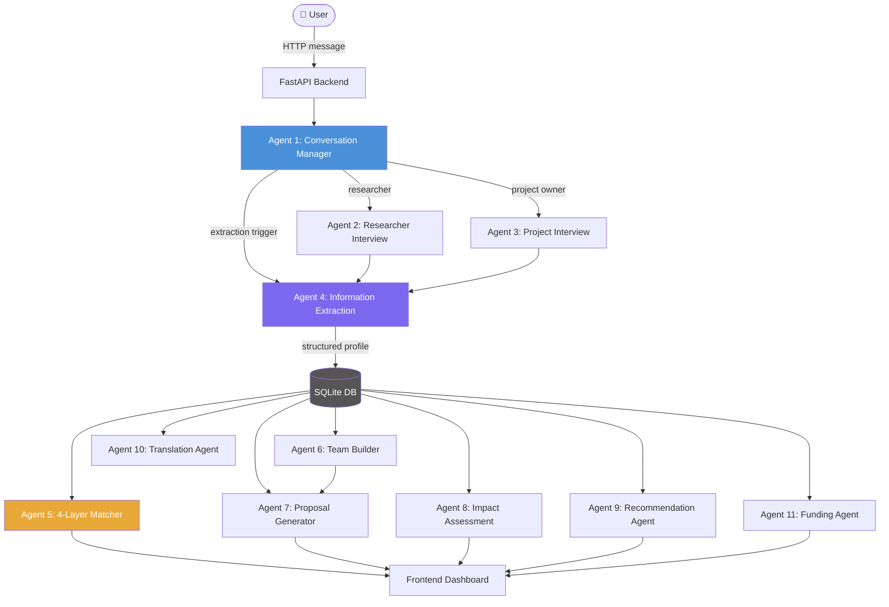
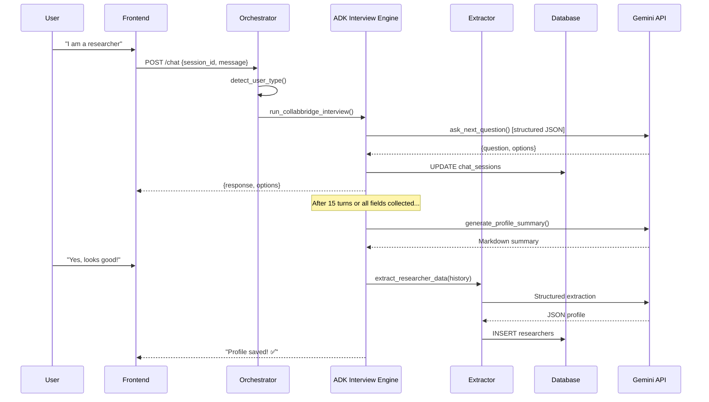
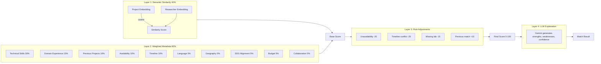
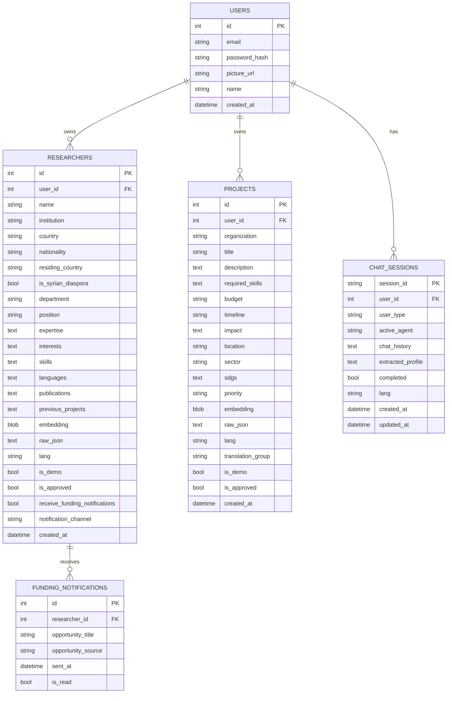
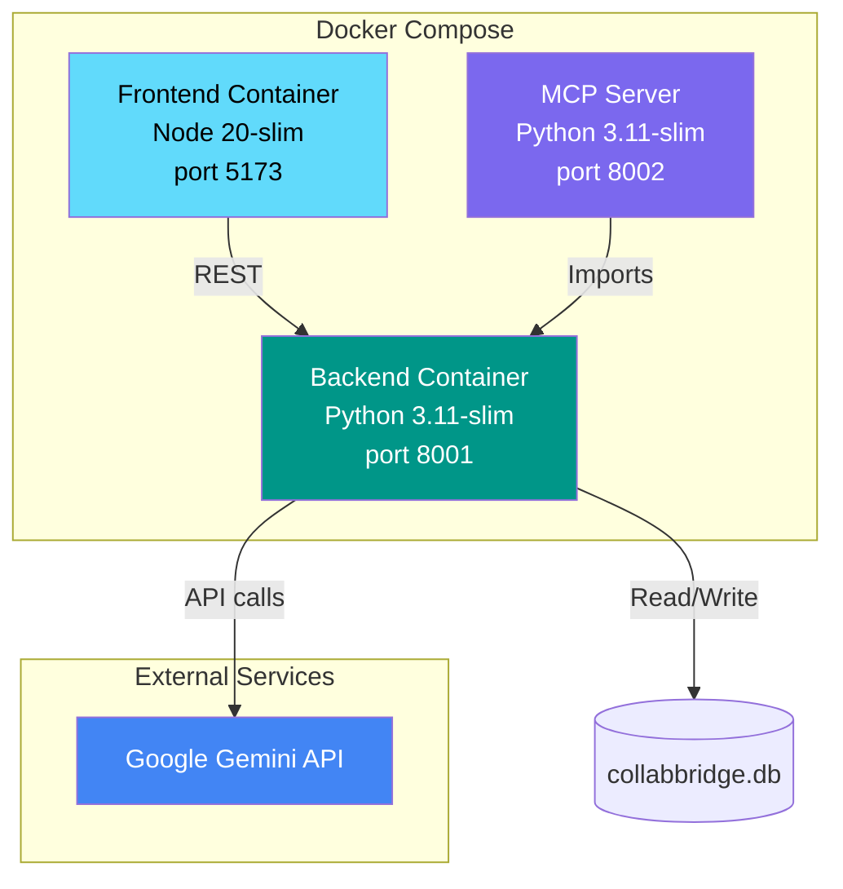

# CollabBridge — System Architecture

This document provides a comprehensive technical architecture reference for the CollabBridge AI platform, including system design, agent architecture, data flow, database schema, and deployment topology.

---

## System Overview

CollabBridge is a **three-tier web application** augmented with an AI agent layer and an MCP server:

```
┌─────────────────────────────────────────────────┐
│                   Tier 1: Frontend              │
│               Vite + React (port 5173)          │
└───────────────────────┬─────────────────────────┘
                        │ HTTP REST
┌───────────────────────▼─────────────────────────┐
│             Tier 2: API Backend                 │
│              FastAPI (port 8001)                │
│  ┌─────────────────────────────────────────┐   │
│  │         Multi-Agent AI Layer            │   │
│  │  11 specialized Gemini-powered agents   │   │
│  └─────────────────────────────────────────┘   │
│  ┌─────────────────────────────────────────┐   │
│  │         Data Access Layer               │   │
│  │  SQLAlchemy ORM + SQLite               │   │
│  └─────────────────────────────────────────┘   │
└───────────────────────┬─────────────────────────┘
                        │ MCP JSON-RPC 2.0
┌───────────────────────▼─────────────────────────┐
│           Tier 3: MCP Server (port 8002)        │
│  Exposes all agent capabilities as MCP tools   │
└─────────────────────────────────────────────────┘
```

---

## Agent Architecture



---

## Multi-Agent Communication Flow



---

## 4-Layer Matching Engine



---

## Database Schema



---

## API Flow

```mermaid
graph TD
    Client([Client]) --> Auth{Authenticated?}
    Auth -->|No| Login[POST /auth/login or /auth/register]
    Auth -->|Yes| Routes

    subgraph Routes
        R1[POST /chat]
        R2[GET /projects]
        R3[GET /researchers]
        R4[POST /match/{project_id}]
        R5[POST /team/{project_id}]
        R6[POST /proposal/{project_id}]
        R7[POST /impact/{project_id}]
        R8[POST /funding]
        R9[GET /health]
    end

    Routes --> Agents[AI Agent Layer]
    Agents --> DB[(Database)]
    Agents --> Gemini[Gemini API]
```

---

## Deployment Architecture


